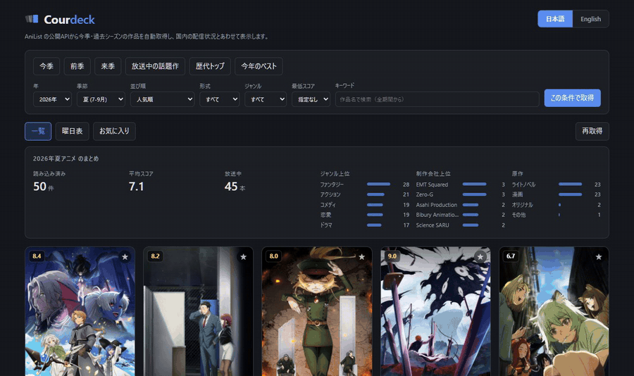
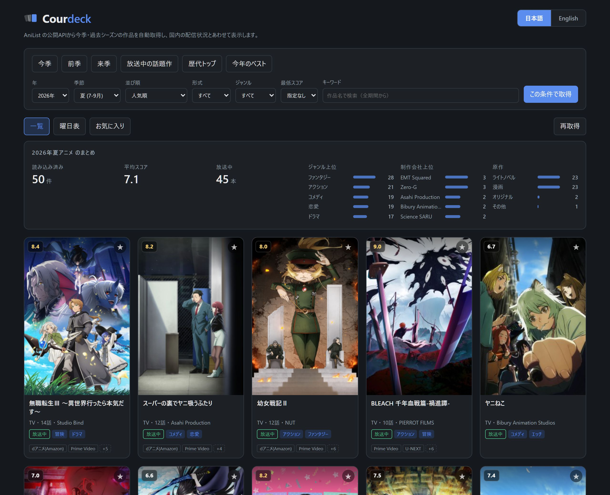
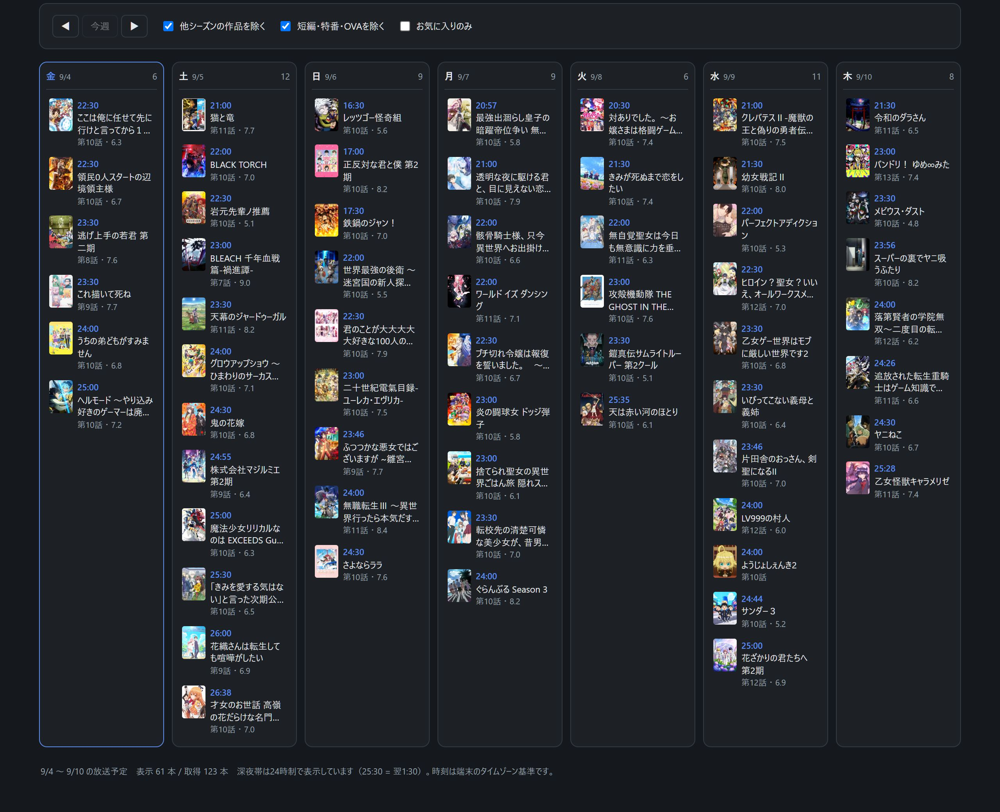
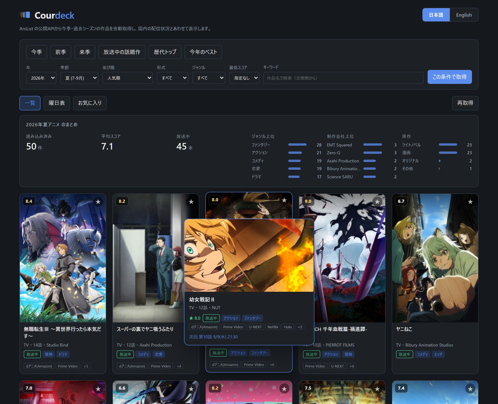
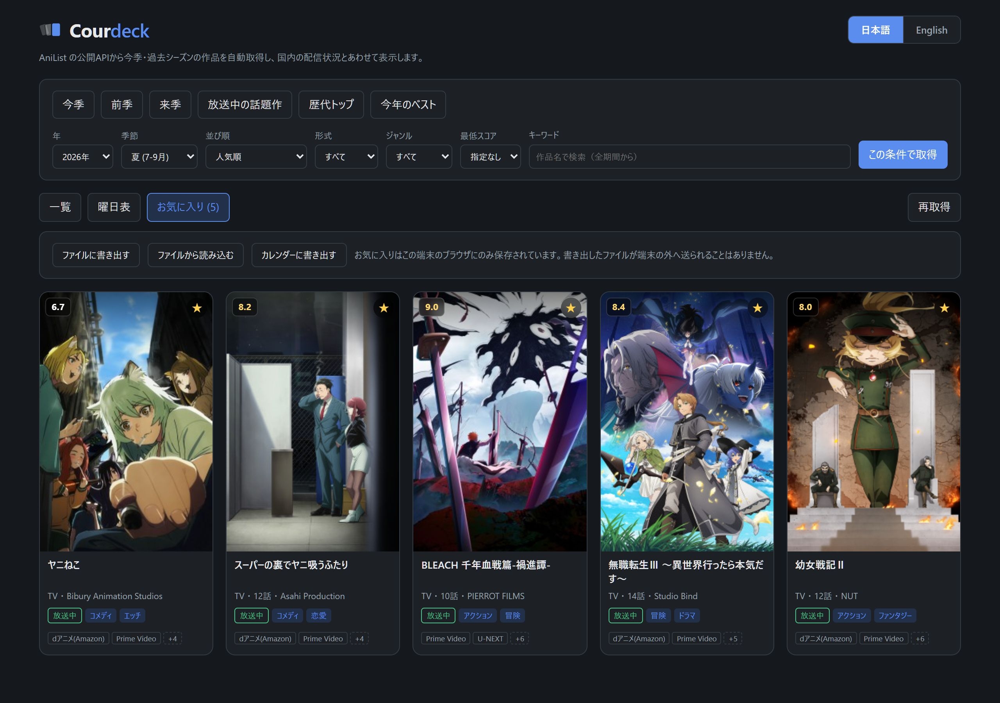
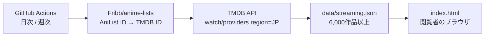

# Courdeck

*English version: [README.md](README.md)*

外部APIから今季・過去のアニメ情報を自動取得し、一覧・集計・週間放送スケジュール・国内の配信状況として表示するWebアプリです。

**→ https://naatlant.github.io/courdeck/**



アプリ本体は依存ライブラリもビルドも不要な単一HTMLファイルです。閲覧者側にAPIキーは要りません。

## 機能

| 機能 | 内容 |
| --- | --- |
| 今季アニメの自動取得 | アクセス日から放送シーズンを判定して表示。前季 / 来季 / 放送中の話題作 / 歴代トップ / 年別ベストをプリセットで切り替え |
| 絞り込み | 年（1960年〜）× 季節 × 並び順6種 × 放送形式 × ジャンル × 最低スコア × キーワード検索 |
| 自動集計 | 件数・平均スコア・放送中本数、ジャンル / 制作会社 / 原作媒体の分布 |
| 週間放送スケジュール | 7日分を曜日別・時刻順に表示。**前後の週へ移動可能**。放送日は朝5時始まりで区切り、深夜帯は24時制表記（25:30 = 翌1:30） |
| **国内の配信サービス** | dアニメ / Prime Video / U-NEXT / Netflix / Hulu など、日本で視聴できるサービスを表示（6,000作品以上） |
| **日本語のあらすじ** | 日本語版Wikipediaの導入部を表示。記事の照合は **GitHub Actions が事前に済ませている**ので、詳細を開いてもWikipediaへのリクエストは出ない。事前解決に無い作品は従来どおり実行時に取得し、それも無ければAniListの英語説明にフォールバック |
| **プレビューパネル** | バナー画像・スコア・配信サービス・次回放送を含む拡大パネル。マウスではホバー、キーボードでは Tab でフォーカスした時点、タッチ環境ではカード上のボタンから開く。`Esc` で閉じる |
| 詳細表示 | 放送期間、次回放送日時、制作会社、原作媒体、PV、公式・配信リンク |
| お気に入り | localStorage に保存し、**JSONファイルへの書き出しと読み込み**に対応。ブラウザのデータを消しても復元でき、PCとスマートフォンの間でも移せる。曜日表を「お気に入りのみ」に絞り込める。次回放送を **iCalendar（`.ics`）** として書き出し、手持ちのカレンダーアプリに取り込める |
| **条件のURL保存** | 絞り込み条件と表示タブがURLに入り、共有・ブックマーク・ブラウザの戻る操作に対応 |
| 自動読み込み | スクロールに応じて次のページを自動取得（連続10ページで一旦停止） |
| キーボード操作 | カードを Tab で辿るとプレビューが開き、Enter / Space で詳細へ。`Esc` で一段戻る。`/` で検索欄へ。モーダル内でフォーカスが循環する |
| オフライン対応 | 通信失敗時は直近のキャッシュへ自動フォールバックし、いつ時点のデータかを表示 |
| **ホーム画面に追加** | スマートフォンのホーム画面から単独アプリとして起動できる。本体と配信情報をキャッシュするので、機内モードでも直前に見た内容が開く。新しい版が出たときは黙って入れ替えず、再読み込みを促す |
| **日本語 / English** | 右上のボタンでいつでも切り替え。作品名・ジャンル・形式・日付表記まで追従し、設定は記憶され URL にも入る（`?lang=en`） |

レスポンシブ対応（PC / タブレット / スマートフォン）、OSのダークモード設定に自動追従します。

### 画面

**一覧** — 今季を人気順で表示。カード下部の配信バッジが、他のアニメデータベースには無い部分です。



**曜日表** — 放送日は朝5時始まり。深夜1:30の放送は前日の 25:30 として並びます。



**プレビュー** — 一覧を離れずに、バナー画像・スコア・配信サービス・次回放送を確認できます。マウスはホバー、キーボードは Tab、タッチはカード上のボタンから開きます。



**お気に入り** — ★を付けた作品だけを集めたタブ。ファイルへの書き出しと読み込み、次回放送のカレンダー書き出しがここにあります。保存先はこの端末のブラウザだけです。



## 技術構成

| 区分 | 内容 |
| --- | --- |
| フロントエンド | 単一HTMLファイル（`index.html`）。HTML + CSS + JavaScript のみ、依存パッケージなし |
| 作品情報 | AniList GraphQL API（`media` / `airingSchedules` の2クエリ、フィールド定義は共有） |
| あらすじ | 日本語版Wikipedia API（完全一致 → 季数を除いた題名 → 検索の3段階で照合）。GitHub Actions が事前に解決し JSON として配信 |
| 配信情報 | TMDB API（データ提供元は JustWatch）。GitHub Actions で取得し JSON として配信 |
| キャッシュ | localStorage に6時間保持（AniList のレート制限 30req/分 対策） |
| 表示 | CSS Grid によるレスポンシブ、`prefers-color-scheme` によるダークモード |

## 配信情報の仕組み

配信情報だけは実行時にAPIを叩きません。GitHub Actions が事前に取得したJSONをアプリが読み込みます。**APIキーはGitHub Secretsに置くため、公開ページには一切出ません。**



分割クールや第N期は同じTMDBシリーズを指すため、TMDB ID単位で重複排除しています（8,123件 → 5,452リクエスト）。

| 実行 | スケジュール | 内容 |
| --- | --- | --- |
| 日次 | 毎日 03:00 JST | 前季〜来季＋歴代トップのみ取得し、既存データにマージ（約250リクエスト） |
| 週次 | 日曜 03:30 JST | 全作品を再取得して置き換え（約5,450リクエスト・6分） |

手動実行時に `mode` へ `all` を指定すると、任意のタイミングで全件更新できます。

### 対応表に無い作品の補完

上流の [anime-offline-database](https://github.com/manami-project/anime-offline-database) はアーカイブ済みで、[Fribb/anime-lists](https://github.com/Fribb/anime-lists) も引き継ぎ手を募集中です。対応表だけに頼ると新作のカバー率がじわじわ落ちていくため、対応表に載っていない作品は**タイトルと放送年から TMDB を検索して補います**（日次実行時のみ、1回あたり上限150件）。

採用の条件は厳しめにしています。**放送年が一致し、記号と空白を落とした題名が完全一致した候補だけ**を採ります。誤った紐付けは、紐付かないことより害が大きいためです。原題 → ローマ字 → 英題 → 別名の順に試し、最初に条件を満たしたものを使います。

照合結果は TMDB ID を含むため、**リポジトリには置かず** GitHub Actions のキャッシュに保持します。公開される `data/streaming.json` に入るのは、従来どおり AniList ID とサービス名だけです。

### カバー率

古い作品ほど下がります。

| 対象 | 配信情報を表示できた割合 |
| --- | --- |
| 歴代トップ50 | 88%（44/50） |
| 2006年春 | 56%（59/106） |
| 2020年春 | 55%（50/91） |
| 1998年春 | 42%（20/48） |

分母は**アプリの一覧に実際に並ぶ作品**です。AniList で `isAdult:false` の全作品で、形式（TV / 劇場版 / OVA / ONA など）は問いません。TV作品だけに絞ると10ポイント前後上がりますが、利用者が目にする画面とは対応しなくなるため採っていません。

この数字は `data/streaming.json` の中身に依存し、更新のたびに動きます。測り直せます。

```
node scripts/coverage.mjs
```

（測定日: 2026-09-04）

## あらすじの仕組み

AniList の説明文は英語だけなので、日本語版Wikipediaの導入部を代わりに表示しています。

以前はこの照合を閲覧者のブラウザが詳細を開くたびに行っていました。その方式には2つの問題がありました。**照合の失敗が利用者ごとに毎回起きる**ことと、**表示のたびに外部へリクエストが出る**ことです。配信情報と同じく、GitHub Actions が事前に解決して `data/synopses.json` に書き出すようにしています。

照合順序は従来の実行時実装と同じです（完全一致 → 季数表記を落とした題名 → 検索の上位3件）。別作品の記事を拾わないよう、記事名と作品名の包含関係も確認します。

アプリ側はこの静的ファイルを見て、**該当が無い作品だけ従来どおり実行時に取得**します。ファイルは詳細を開くまで読み込まないので、初期表示の速さは変わりません。

### 誤った記事に紐付いたとき

`data/synopses-overrides.json` に作品IDと記事名を書けば、次の生成からそちらが優先されます。

```json
{
  "items": {
    "21": { "wikiTitle": "ONE PIECE (アニメ)" }
  }
}
```

どの記事にも当てたくない場合は `{ "skip": true }` を指定します。

### ライセンス上の扱い

**Wikipedia の本文は CC BY-SA 4.0 です。** `data/synopses.json` は MIT ではありません。各項目に記事名と記事URLを持たせ、帰属表示が本文と一緒に運ばれるようにしています。保存しているのは導入部の抜粋（最大600文字）だけで、記事全文は保存しません。

## ファイル構成

```
index.html                        アプリ本体（単一ファイル）
anime.html                        旧URL用のリダイレクト
manifest.webmanifest              ホーム画面への追加用（任意。無くても index.html は動く）
sw.js                             オフライン用の Service Worker（任意）
data/streaming.json               国内の配信情報（Actions が生成）
data/synopses.json                事前解決したあらすじ（CC BY-SA、Actions が生成）
data/synopses-overrides.json      誤った記事に紐付いたときの手動修正
scripts/fetch-streaming.mjs       配信情報の取得スクリプト
scripts/fetch-synopses.mjs        日本語版Wikipediaの記事を事前に解決する
scripts/season-targets.mjs        上記2つが共通で使う対象作品の選定
scripts/coverage.mjs              READMEのカバー率を測り直す
scripts/date-logic.mjs            テスト用に index.html から日付ロジックを取り出す
scripts/serve.mjs                 手元で確認するための静的サーバー
test/date-logic.test.mjs          日付ロジックのテスト（node:test）
CLAUDE.md                         開発時の指針とデータ源の制約
.github/workflows/streaming.yml   日次 / 週次の配信情報更新
.github/workflows/synopses.yml    週次のあらすじ更新
.github/workflows/test.yml        push と PR でテストを実行する
assets/                           TMDBロゴ、OG画像、アイコン、READMEのスクリーンショットとGIF
```

## 使い方

### そのまま使う

https://naatlant.github.io/courdeck/ を開くだけです。**登録もインストールも不要**で、すぐに操作できます。

- 開いた瞬間は今季のアニメが人気順で並びます
- 上部のボタン（今季 / 前季 / 来季 / 放送中の話題作 / 歴代トップ / 今年のベスト）でよく使う条件に一発で切り替えられます
- 細かく絞り込むときは「詳細な絞り込み」から年・季節・並び順・形式・ジャンル・最低スコアを指定します
- **曜日表**タブで今週の放送予定を曜日別に確認できます
- カードの★でお気に入りに登録すると、曜日表を「お気に入りのみ」に絞れます。**自分の視聴予定表として使えます**
- 右上のボタンで日本語と英語を切り替えられます

保存されるのはお使いのブラウザの中だけです。アカウントもサーバーもありません。

### URLで条件を指定する

絞り込み条件はすべてURLに入るので、**特定の画面をそのままブックマーク・共有できます**。手で組み立てることもできます。

| パラメータ | 値 | 例 |
| --- | --- | --- |
| `lang` | `ja` / `en` | `?lang=en` |
| `view` | `cal`（曜日表） / `fav`（お気に入り） | `?view=cal` |
| `year` | 1960〜（空にすると全期間） | `?year=2016&season=` |
| `season` | `WINTER` / `SPRING` / `SUMMER` / `FALL`（空で通年） | `?year=2016&season=FALL` |
| `sort` | `POPULARITY_DESC` / `SCORE_DESC` / `TRENDING_DESC` / `START_DATE_DESC` / `FAVOURITES_DESC` / `TITLE_ROMAJI` | `?sort=SCORE_DESC` |
| `format` | `TV` / `TV_SHORT` / `MOVIE` / `OVA` / `ONA` / `SPECIAL` | `?format=MOVIE` |
| `genre` | AniListのジャンル名（`Action`, `Romance`, `Sci-Fi` など） | `?genre=Sci-Fi` |
| `score` | `60` / `70` / `75` / `80` / `85`（最低スコア） | `?score=80` |
| `q` | 作品名のキーワード（指定すると年・季節は無視されます） | `?q=%E9%8B%BC%E3%81%AE%E9%8C%AC%E9%87%91%E8%A1%93%E5%B8%AB` |

具体例:

```
# 2016年秋アニメをスコア順で
https://naatlant.github.io/courdeck/?year=2016&season=FALL&sort=SCORE_DESC

# 今週の放送予定
https://naatlant.github.io/courdeck/?view=cal

# 歴代のSF作品でスコア80以上
https://naatlant.github.io/courdeck/?year=&season=&genre=Sci-Fi&score=80&sort=SCORE_DESC
```

年・季節を省略すると「その時点の今季」になります。**「今季アニメ」へのリンクとして貼っておけば、シーズンが変わっても自動で最新になります。**

### 自分のサイトに埋め込む

`iframe` でそのまま置けます。

```html
<iframe src="https://naatlant.github.io/courdeck/?view=cal&lang=ja"
        width="100%" height="800" style="border:0" loading="lazy"
        title="Courdeck"></iframe>
```

### 手元に置いて使う

アプリは1ファイルなので、ダウンロードするだけで動きます。

```
curl -O https://naatlant.github.io/courdeck/index.html
```

ブラウザで開けば、作品一覧・曜日表・検索はすべて動作します。ただし **`file://` で開くと配信情報だけ表示されません**。ブラウザがローカルファイルへの `fetch` を禁止しているためです。配信情報も見たい場合は、`data/streaming.json` も一緒に置いたうえで、任意の静的サーバー経由で開いてください。

```
git clone https://github.com/Naatlant/courdeck.git
cd courdeck
node scripts/serve.mjs   # → http://localhost:8765
```

### テスト

このアプリで最も静かに壊れやすいのが日付処理です。放送日を朝5時で区切ること、深夜帯を24時を超える表記で出すこと、アクセス日から今季を判定すること。いずれも1日ずれていても画面上はそれらしく見えてしまうため、この部分にはテストを置いています。テストフレームワークは入れておらず、`node:test` と `node:assert` だけで動きます。

```
node --test
```

`scripts/date-logic.mjs` が `index.html` の `date-logic` の目印で囲まれた範囲を読み出し、テストへ渡します。`index.html` は単一ファイルのまま、ビルド工程も増えません。テストは `TZ=Asia/Tokyo` を固定します。朝5時始まりが日本の放送の慣習である一方、CIのランナーは UTC で動くためです。

### 自分のGitHub Pagesで公開する

リポジトリをフォークし、Settings → Pages で `main` / `(root)` を指定すれば、そのまま自分のURLで公開できます。配信情報を更新し続けたい場合のみ、次の設定が必要です。

### 動作環境

Chrome / Edge / Firefox / Safari の現行版。スマートフォンでも動作します。

## フォークして配信情報を更新する場合

配信情報の更新を動かすには、以下の設定が必要です。表示するだけなら不要です。

1. [TMDB](https://www.themoviedb.org/settings/api) で無料のAPIキーを取得する（Developer を選択）
2. リポジトリの Settings → Secrets and variables → Actions で `TMDB_API_KEY` を登録する
3. Settings → Actions → General → Workflow permissions を **Read and write permissions** にする

ローカルで手動実行する場合は、リポジトリ直下に `.tmdb_key` というファイルを作ってキーだけを書いてください（`.gitignore` 済み）。

```
node scripts/fetch-streaming.mjs        # 前季〜来季＋歴代トップ（マージ）
node scripts/fetch-streaming.mjs --all  # 全作品（全置換）
```

## ライセンス

ソースコードは [MIT License](LICENSE) です。ただし**適用範囲はこのリポジトリで書かれたコードに限られます**。

| 対象 | ライセンス |
| --- | --- |
| `index.html` / `anime.html` / `sw.js` / `manifest.webmanifest` / `scripts/` / `test/` / `.github/` / `data/synopses-overrides.json` | MIT |
| `assets/icon-*.png` / `assets/apple-touch-icon.png` / `assets/og.png` | MIT。このリポジトリで作った図版（ロゴと文字だけ） |
| `data/streaming.json` | **MIT対象外**。TMDB / JustWatch に帰属 |
| `assets/tmdb.svg` | **MIT対象外**。TMDBの商標（帰属表示のために同梱） |
| `assets/demo.gif` / `assets/screenshot-*.jpg` | **MIT対象外**。動作中の画面を撮影したもので、写り込んでいる表紙・バナー画像の権利は各権利者に帰属 |
| `data/synopses.json` | **MIT対象外。[CC BY-SA 4.0](https://creativecommons.org/licenses/by-sa/4.0/)** — [日本語版Wikipedia](https://ja.wikipedia.org/)の導入部からの抜粋。各項目に記事名と記事URLを持たせ、帰属表示が本文と一緒に運ばれるようにしている。再利用する場合は同じライセンスで |

配信データは [TMDB API Terms of Use](https://www.themoviedb.org/api-terms-of-use) に従います。同規約はTMDBコンテンツの再許諾（sublicense）を認めていないため、このJSONを再利用する場合は、**ご自身でTMDBのAPIキーを取得し、同規約を遵守してください**。商用利用はできません（広告収入や集客目的の利用も商用と見なされます）。

## プライバシー

利用者の情報は一切収集しません。アクセス解析も広告も、独自のサーバーもありません。お気に入りや表示設定はブラウザの localStorage にのみ保存され、端末外へ送信されることはありません。お気に入りの書き出しは端末内にファイルを保存するだけ、読み込みは `FileReader` で読むだけで、どちらもサーバーとの通信は発生しません。

## 各データ源の規約について

- **非公式**。本プロジェクトは AniList・TMDB と提携関係になく、これらの承認を受けたものでもありません。
- **AniList** はAPIの非営利利用を認めており、競合するリスト／トラッカーサービスとしての利用を制限しています。本アプリは各作品からAniListのページへリンクを張り、AniListが持たない日本国内の情報（配信状況、放送日の扱い）を加える位置づけです。
- **ID対応表とODbL**。[Fribb/anime-lists](https://github.com/Fribb/anime-lists) 自体はライセンス未設定ですが、派生元の [anime-offline-database](https://github.com/manami-project/anime-offline-database) は **ODbL 1.0 / DbCL 1.0** で公開されています。ODbLは派生データベースの同一ライセンス公開を求めており、これはTMDBの再許諾禁止と衝突します。そのため**対応表はビルド中の照合にのみ使い、`data/streaming.json` にTMDBのIDを一切書き出していません**。公開しているのはAniList IDとサービス名だけです。
- **上流の維持状況**。anime-offline-database はアーカイブ済みで、Fribb/anime-lists は[引き継ぎ手を募集中](https://github.com/Fribb/anime-lists/issues/30)です。新規作品のカバー率は今後伸びなくなる可能性があります。
- 表紙画像は AniList のCDNから配信されており、権利は各権利者に帰属します。

## クレジット

- 作品情報・画像: [AniList](https://anilist.co)
- あらすじ: [ウィキペディア日本語版](https://ja.wikipedia.org/)（CC BY-SA）
- 配信情報: [](https://www.themoviedb.org/) / JustWatch
- ID対応表: [Fribb/anime-lists](https://github.com/Fribb/anime-lists) ← [anime-offline-database](https://github.com/manami-project/anime-offline-database)（[ODbL 1.0](https://opendatacommons.org/licenses/odbl/1-0/) / DbCL 1.0）

> This application uses TMDB and the TMDB APIs but is not endorsed, certified, or otherwise approved by TMDB.

各作品の権利は権利者に帰属します。本リポジトリは非営利の公開ツールであり、表示内容の正確性を保証するものではありません。配信状況は変動するため、実際の視聴可否は各サービスでご確認ください。
