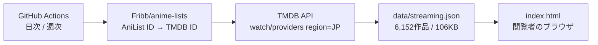

# Courdeck

*English version: [README.md](README.md)*

外部APIから今季・過去のアニメ情報を自動取得し、一覧・集計・週間放送スケジュール・国内の配信状況として表示するWebアプリです。

**→ https://naatlant.github.io/courdeck/**

アプリ本体は依存ライブラリもビルドも不要な単一HTMLファイルです。閲覧者側にAPIキーは要りません。

## 機能

| 機能 | 内容 |
| --- | --- |
| 今季アニメの自動取得 | アクセス日から放送シーズンを判定して表示。前季 / 来季 / 放送中の話題作 / 歴代トップ / 年別ベストをプリセットで切り替え |
| 絞り込み | 年（1960年〜）× 季節 × 並び順6種 × 放送形式 × ジャンル × 最低スコア × キーワード検索 |
| 自動集計 | 件数・平均スコア・放送中本数、ジャンル / 制作会社 / 原作媒体の分布 |
| 週間放送スケジュール | 7日分を曜日別・時刻順に表示。**前後の週へ移動可能**。放送日は朝5時始まりで区切り、深夜帯は24時制表記（25:30 = 翌1:30） |
| **国内の配信サービス** | dアニメ / Prime Video / U-NEXT / Netflix / Hulu など、日本で視聴できるサービスを表示（6,152作品） |
| **日本語のあらすじ** | 日本語版Wikipediaの導入部を取得して表示。記事が無い作品はAniListの英語説明にフォールバック |
| **ホバープレビュー** | カードにカーソルを合わせると、バナー画像・スコア・次回放送を含む拡大パネルを表示 |
| 詳細表示 | 放送期間、次回放送日時、制作会社、原作媒体、PV、公式・配信リンク |
| お気に入り | localStorage に保存。曜日表を「お気に入りのみ」に絞り込める |
| **条件のURL保存** | 絞り込み条件と表示タブがURLに入り、共有・ブックマーク・ブラウザの戻る操作に対応 |
| 自動読み込み | スクロールに応じて次のページを自動取得（連続10ページで一旦停止） |
| キーボード操作 | カードを Tab で辿り Enter / Space で詳細を開ける。`/` で検索欄へ。モーダル内でフォーカスが循環する |
| オフライン対応 | 通信失敗時は直近のキャッシュへ自動フォールバックし、いつ時点のデータかを表示 |
| **日本語 / English** | 右上のボタンでいつでも切り替え。作品名・ジャンル・形式・日付表記まで追従し、設定は記憶され URL にも入る（`?lang=en`） |

レスポンシブ対応（PC / タブレット / スマートフォン）、OSのダークモード設定に自動追従します。

## 技術構成

| 区分 | 内容 |
| --- | --- |
| フロントエンド | 単一HTMLファイル（`index.html`、約1,450行）。HTML + CSS + JavaScript のみ、依存パッケージなし |
| 作品情報 | AniList GraphQL API（`media` / `airingSchedules` の2クエリ、フィールド定義は共有） |
| あらすじ | 日本語版Wikipedia API（完全一致 → 季数を除いた題名 → 検索の3段階で照合） |
| 配信情報 | TMDB API（データ提供元は JustWatch）。GitHub Actions で取得し JSON として配信 |
| キャッシュ | localStorage に6時間保持（AniList のレート制限 30req/分 対策） |
| 表示 | CSS Grid によるレスポンシブ、`prefers-color-scheme` によるダークモード |

## 配信情報の仕組み

配信情報だけは実行時にAPIを叩きません。GitHub Actions が事前に取得したJSONをアプリが読み込みます。**APIキーはGitHub Secretsに置くため、公開ページには一切出ません。**



分割クールや第N期は同じTMDBシリーズを指すため、TMDB ID単位で重複排除しています（8,123件 → 5,452リクエスト）。

| 実行 | スケジュール | 内容 |
| --- | --- | --- |
| 日次 | 毎日 03:00 JST | 前季〜来季＋歴代トップのみ取得し、既存データにマージ（約250リクエスト） |
| 週次 | 日曜 03:30 JST | 全作品を再取得して置き換え（約5,450リクエスト・6分） |

手動実行時に `mode` へ `all` を指定すると、任意のタイミングで全件更新できます。

### カバー率

対応表にTMDB IDが存在する作品のみが対象です。古い作品ほど下がります。

| 対象 | 配信情報を表示できた割合 |
| --- | --- |
| 歴代トップ50 | 88% |
| 2006年春 | 82% |
| 2020年春 | 76% |
| 1998年春 | 42% |

## ファイル構成

```
index.html                        アプリ本体（単一ファイル）
anime.html                        旧URL用のリダイレクト
data/streaming.json               国内の配信情報（Actions が生成）
scripts/fetch-streaming.mjs       配信情報の取得スクリプト
scripts/serve.mjs                 手元で確認するための静的サーバー
.github/workflows/streaming.yml   日次 / 週次の更新ワークフロー
```

## 使い方

### そのまま使う

https://naatlant.github.io/courdeck/ を開くだけです。**登録もインストールも不要**で、すぐに操作できます。

- 開いた瞬間は今季のアニメが人気順で並びます
- 上部のボタン（今季 / 前季 / 来季 / 放送中の話題作 / 歴代トップ / 今年のベスト）でよく使う条件に一発で切り替えられます
- 細かく絞り込むときは「詳細な絞り込み」から年・季節・並び順・形式・ジャンル・最低スコアを指定します
- **曜日表**タブで今週の放送予定を曜日別に確認できます
- カードの★でお気に入りに登録すると、曜日表を「お気に入りのみ」に絞れます。**自分の視聴予定表として使えます**
- 右上のボタンで日本語と英語を切り替えられます

保存されるのはお使いのブラウザの中だけです。アカウントもサーバーもありません。

### URLで条件を指定する

絞り込み条件はすべてURLに入るので、**特定の画面をそのままブックマーク・共有できます**。手で組み立てることもできます。

| パラメータ | 値 | 例 |
| --- | --- | --- |
| `lang` | `ja` / `en` | `?lang=en` |
| `view` | `cal`（曜日表） / `fav`（お気に入り） | `?view=cal` |
| `year` | 1960〜（空にすると全期間） | `?year=2016&season=` |
| `season` | `WINTER` / `SPRING` / `SUMMER` / `FALL`（空で通年） | `?year=2016&season=FALL` |
| `sort` | `POPULARITY_DESC` / `SCORE_DESC` / `TRENDING_DESC` / `START_DATE_DESC` / `FAVOURITES_DESC` / `TITLE_ROMAJI` | `?sort=SCORE_DESC` |
| `format` | `TV` / `TV_SHORT` / `MOVIE` / `OVA` / `ONA` / `SPECIAL` | `?format=MOVIE` |
| `genre` | AniListのジャンル名（`Action`, `Romance`, `Sci-Fi` など） | `?genre=Sci-Fi` |
| `score` | `60` / `70` / `75` / `80` / `85`（最低スコア） | `?score=80` |
| `q` | 作品名のキーワード（指定すると年・季節は無視されます） | `?q=%E9%8B%BC%E3%81%AE%E9%8C%AC%E9%87%91%E8%A1%93%E5%B8%AB` |

具体例:

```
# 2016年秋アニメをスコア順で
https://naatlant.github.io/courdeck/?year=2016&season=FALL&sort=SCORE_DESC

# 今週の放送予定
https://naatlant.github.io/courdeck/?view=cal

# 歴代のSF作品でスコア80以上
https://naatlant.github.io/courdeck/?year=&season=&genre=Sci-Fi&score=80&sort=SCORE_DESC
```

年・季節を省略すると「その時点の今季」になります。**「今季アニメ」へのリンクとして貼っておけば、シーズンが変わっても自動で最新になります。**

### 自分のサイトに埋め込む

`iframe` でそのまま置けます。

```html
<iframe src="https://naatlant.github.io/courdeck/?view=cal&lang=ja"
        width="100%" height="800" style="border:0" loading="lazy"
        title="Courdeck"></iframe>
```

### 手元に置いて使う

アプリは1ファイルなので、ダウンロードするだけで動きます。

```
curl -O https://naatlant.github.io/courdeck/index.html
```

ブラウザで開けば、作品一覧・曜日表・検索はすべて動作します。ただし **`file://` で開くと配信情報だけ表示されません**。ブラウザがローカルファイルへの `fetch` を禁止しているためです。配信情報も見たい場合は、`data/streaming.json` も一緒に置いたうえで、任意の静的サーバー経由で開いてください。

```
git clone https://github.com/Naatlant/courdeck.git
cd courdeck
node scripts/serve.mjs   # → http://localhost:8765
```

### 自分のGitHub Pagesで公開する

リポジトリをフォークし、Settings → Pages で `main` / `(root)` を指定すれば、そのまま自分のURLで公開できます。配信情報を更新し続けたい場合のみ、次の設定が必要です。

### 動作環境

Chrome / Edge / Firefox / Safari の現行版。スマートフォンでも動作します。

## フォークして配信情報を更新する場合

配信情報の更新を動かすには、以下の設定が必要です。表示するだけなら不要です。

1. [TMDB](https://www.themoviedb.org/settings/api) で無料のAPIキーを取得する（Developer を選択）
2. リポジトリの Settings → Secrets and variables → Actions で `TMDB_API_KEY` を登録する
3. Settings → Actions → General → Workflow permissions を **Read and write permissions** にする

ローカルで手動実行する場合は、リポジトリ直下に `.tmdb_key` というファイルを作ってキーだけを書いてください（`.gitignore` 済み）。

```
node scripts/fetch-streaming.mjs        # 前季〜来季＋歴代トップ（マージ）
node scripts/fetch-streaming.mjs --all  # 全作品（全置換）
```

## ライセンス

ソースコードは [MIT License](LICENSE) です。ただし**適用範囲はこのリポジトリで書かれたコードに限られます**。

| 対象 | ライセンス |
| --- | --- |
| `index.html` / `anime.html` / `scripts/` / `.github/` | MIT |
| `data/streaming.json` | **MIT対象外**。TMDB / JustWatch に帰属 |
| `assets/tmdb.svg` | **MIT対象外**。TMDBの商標（帰属表示のために同梱） |

配信データは [TMDB API Terms of Use](https://www.themoviedb.org/api-terms-of-use) に従います。同規約はTMDBコンテンツの再許諾（sublicense）を認めていないため、このJSONを再利用する場合は、**ご自身でTMDBのAPIキーを取得し、同規約を遵守してください**。商用利用はできません（広告収入や集客目的の利用も商用と見なされます）。

## プライバシー

利用者の情報は一切収集しません。アクセス解析も広告も、独自のサーバーもありません。お気に入りや表示設定はブラウザの localStorage にのみ保存され、端末外へ送信されることはありません。

## 各データ源の規約について

- **非公式**。本プロジェクトは AniList・TMDB と提携関係になく、これらの承認を受けたものでもありません。
- **AniList** はAPIの非営利利用を認めており、競合するリスト／トラッカーサービスとしての利用を制限しています。本アプリは各作品からAniListのページへリンクを張り、AniListが持たない日本国内の情報（配信状況、放送日の扱い）を加える位置づけです。
- **ID対応表とODbL**。[Fribb/anime-lists](https://github.com/Fribb/anime-lists) 自体はライセンス未設定ですが、派生元の [anime-offline-database](https://github.com/manami-project/anime-offline-database) は **ODbL 1.0 / DbCL 1.0** で公開されています。ODbLは派生データベースの同一ライセンス公開を求めており、これはTMDBの再許諾禁止と衝突します。そのため**対応表はビルド中の照合にのみ使い、`data/streaming.json` にTMDBのIDを一切書き出していません**。公開しているのはAniList IDとサービス名だけです。
- **上流の維持状況**。anime-offline-database はアーカイブ済みで、Fribb/anime-lists は[引き継ぎ手を募集中](https://github.com/Fribb/anime-lists/issues/30)です。新規作品のカバー率は今後伸びなくなる可能性があります。
- 表紙画像は AniList のCDNから配信されており、権利は各権利者に帰属します。

## クレジット

- 作品情報・画像: [AniList](https://anilist.co)
- あらすじ: [ウィキペディア日本語版](https://ja.wikipedia.org/)（CC BY-SA）
- 配信情報: [](https://www.themoviedb.org/) / JustWatch
- ID対応表: [Fribb/anime-lists](https://github.com/Fribb/anime-lists) ← [anime-offline-database](https://github.com/manami-project/anime-offline-database)（[ODbL 1.0](https://opendatacommons.org/licenses/odbl/1-0/) / DbCL 1.0）

> This application uses TMDB and the TMDB APIs but is not endorsed, certified, or otherwise approved by TMDB.

各作品の権利は権利者に帰属します。本リポジトリは非営利の公開ツールであり、表示内容の正確性を保証するものではありません。配信状況は変動するため、実際の視聴可否は各サービスでご確認ください。
