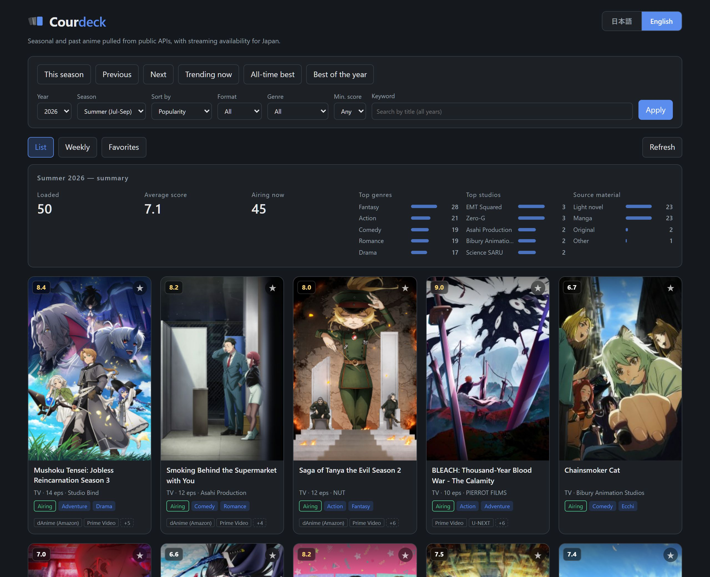
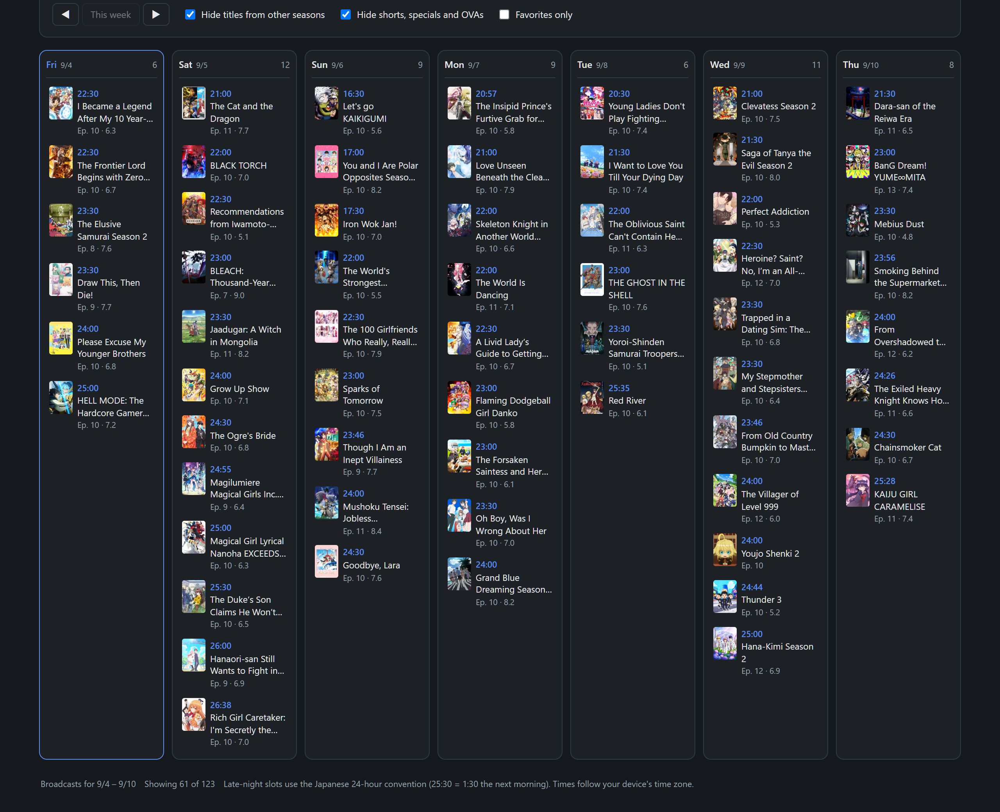
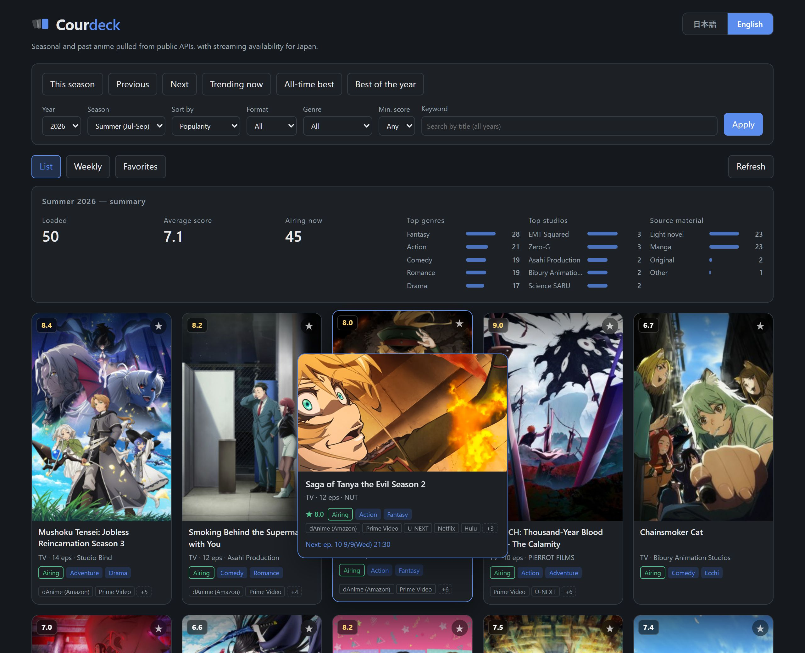
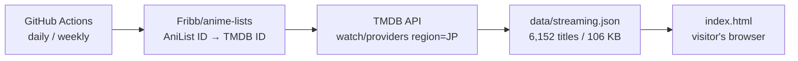

# Courdeck

*日本語版は [README.ja.md](README.ja.md) をご覧ください。*

A single-file web app that collects seasonal anime from public APIs and shows them as a
browsable list, a weekly broadcast schedule, and — the part you won't find in most anime
trackers — **where each title is actually streaming in Japan**.

**→ https://naatlant.github.io/courdeck/**


No build step, no framework, no API key required for visitors. The app itself is one HTML
file you can open in a browser.

> **Note**: the interface is available in **English and Japanese** (toggle in the top-right,
> or add `?lang=en` / `?lang=ja` to the URL). Streaming availability is Japan-only, which
> is the point — services like dAnime, U-NEXT and FOD rarely show up in international anime
> databases.

## Features

| Feature | Description |
| --- | --- |
| Seasonal listing | Detects the current broadcast season from the visitor's date. One-click presets for previous / next season, currently airing, all-time top, and best of the year |
| Filtering | Year (1960–) × season × 6 sort orders × format × genre × minimum score × keyword search |
| Automatic stats | Title count, average score, number currently airing, plus distribution by genre / studio / source material |
| Weekly schedule | Seven days of broadcasts by day of week, **with navigation to other weeks**. Days start at 5 a.m. and late-night slots use the Japanese 24-hour convention (25:30 = 1:30 the next morning) |
| **Streaming in Japan** | dAnime, Prime Video, U-NEXT, Netflix, Hulu and others, for 6,152 titles |
| **Japanese synopses** | The upstream synopsis is English only, so the app pulls the lead section of the Japanese Wikipedia article and falls back to English when no article matches |
| **Preview panel** | An enlarged panel with the banner art, score, streaming services and next episode. Opens on hover with a mouse, on focus while tabbing, and from a button on the card on touch devices. `Escape` closes it |
| Details | Air period, next episode, studio, source material, trailer, official and streaming links |
| Favorites | Stored in localStorage, with **export and import as a JSON file** so a cleared browser does not lose them and a phone and a desktop can share the same list. The weekly schedule can be filtered down to favorites only |
| **Shareable URLs** | Filters and the active tab live in the query string, so any view can be bookmarked, shared, and navigated with the browser's back button |
| Infinite scroll | Loads the next page as you scroll, pausing after 10 consecutive pages |
| Keyboard support | Tab through cards to open the preview panel and press Enter / Space for the full details, `Escape` steps back out, `/` focuses the search box, and focus stays inside the dialog |
| Offline tolerance | Falls back to the most recent cached response and tells you how old it is |
| **Installable** | Add it to a phone's home screen and it launches standalone. The app shell and the streaming data are cached, so the last thing you looked at still opens in airplane mode. When a new version ships you get a reload prompt rather than a silent swap |
| **English / Japanese** | Switch languages at any time. Titles, genres, formats and dates all follow the choice, and the setting is remembered and carried in the URL |

Responsive down to phone width, and follows the OS light/dark preference.

### Screenshots

**Seasonal list** — this season in popularity order. The badges under each card are the part
you won't find elsewhere: where the title is actually streaming in Japan.



**Weekly schedule** — a broadcast day starts at 5 a.m., so a 1:30 a.m. show is filed under the
previous day and written 25:30, the way Japanese schedules do it.



**Hover preview** — banner art, score, streaming services and the next episode, without leaving the list.



## Tech stack

| Area | Details |
| --- | --- |
| Front end | One HTML file (`index.html`, ~1,450 lines). HTML + CSS + vanilla JavaScript, zero dependencies |
| Anime data | [AniList](https://anilist.co) GraphQL API (two queries sharing one field fragment) |
| Synopses | Japanese Wikipedia API (exact title → title without season markers → search) |
| Streaming | TMDB API, data sourced from JustWatch. Fetched by GitHub Actions, served as a static JSON file |
| Caching | localStorage, 6 hours (AniList allows 30 requests/minute) |
| Layout | CSS Grid, `prefers-color-scheme` |

## How the streaming data works

The app never calls the streaming API at runtime. GitHub Actions fetches the data ahead of
time and commits a static JSON file. **The API key lives in GitHub Secrets and never reaches
the published page.**



Split-cour releases and sequels point at the same TMDB series, so requests are deduplicated
by TMDB ID before fetching (8,123 entries → 5,452 requests).

| Run | Schedule | Scope |
| --- | --- | --- |
| Daily | 03:00 JST | Previous/current/next season plus all-time top, merged into the existing data (~250 requests) |
| Weekly | Sunday 03:30 JST | Full refresh of every mapped title (~5,450 requests, about 6 minutes) |

### Filling gaps in the ID mapping

Upstream, [anime-offline-database](https://github.com/manami-project/anime-offline-database) is
archived and [Fribb/anime-lists](https://github.com/Fribb/anime-lists) is looking for a new
maintainer, so relying on the mapping alone means coverage of new titles slowly decays. Titles
missing from the mapping are therefore **looked up on TMDB by title and broadcast year** (daily
run only, at most 150 per run).

The bar for accepting a match is deliberately high: **the year must line up and the title must
match exactly** once punctuation and whitespace are stripped, because a wrong link is worse than
no link. Native title → romaji → English → synonyms are tried in that order, and the first
candidate that clears the bar wins.

Those results contain TMDB identifiers, so they are **kept out of the repository** and held in
the GitHub Actions cache instead. The published `data/streaming.json` still carries nothing but
AniList IDs and service names.

### Coverage

Only titles that exist in the ID mapping can carry streaming data, so older shows drop off.

| Sample | Titles with streaming data |
| --- | --- |
| All-time top 50 | 88% |
| Spring 2006 | 82% |
| Spring 2020 | 76% |
| Spring 1998 | 42% |

## Repository layout

```
index.html                        the app (single file)
anime.html                        redirect kept for older links
data/streaming.json               Japanese streaming availability (generated by Actions)
scripts/fetch-streaming.mjs       fetch script
scripts/serve.mjs                 local static server for previewing
scripts/date-logic.mjs            lifts the date functions out of index.html for the tests
test/date-logic.test.mjs          node:test suite covering the date handling
CLAUDE.md                         conventions and upstream constraints for contributors
.github/workflows/streaming.yml   daily / weekly update workflow
.github/workflows/test.yml        runs the tests on push and pull requests
manifest.webmanifest              home-screen install (optional; index.html works without it)
sw.js                             service worker for offline use (optional)
assets/                           TMDB logo, social card, icons, README screenshots and demo GIF
```

## Usage

### Just use it

Open https://naatlant.github.io/courdeck/. **No sign-up, no install.**

- It opens on the current season, sorted by popularity
- The buttons along the top jump to common views: this season, previous, next, trending now,
  all-time best, best of the year
- "More filters" exposes year, season, sort order, format, genre and minimum score
- The **Weekly** tab lays out this week's broadcasts by day
- Star a title and the weekly view can be narrowed to favorites only — a personal watch
  schedule
- The button in the top-right switches between English and Japanese

Everything you save stays in your own browser. There are no accounts and no server.

### Link to a specific view

Every filter lives in the URL, so **any view can be bookmarked or shared** — and you can
build links by hand.

| Parameter | Values | Example |
| --- | --- | --- |
| `lang` | `en` / `ja` | `?lang=en` |
| `view` | `cal` (weekly) / `fav` (favorites) | `?view=cal` |
| `year` | 1960– (empty means all years) | `?year=2016&season=` |
| `season` | `WINTER` / `SPRING` / `SUMMER` / `FALL` (empty means whole year) | `?year=2016&season=FALL` |
| `sort` | `POPULARITY_DESC` / `SCORE_DESC` / `TRENDING_DESC` / `START_DATE_DESC` / `FAVOURITES_DESC` / `TITLE_ROMAJI` | `?sort=SCORE_DESC` |
| `format` | `TV` / `TV_SHORT` / `MOVIE` / `OVA` / `ONA` / `SPECIAL` | `?format=MOVIE` |
| `genre` | AniList genre name (`Action`, `Romance`, `Sci-Fi`, …) | `?genre=Sci-Fi` |
| `score` | `60` / `70` / `75` / `80` / `85` (minimum) | `?score=80` |
| `q` | Title keyword (year and season are ignored when set) | `?q=Fullmetal` |

```
# Fall 2016, sorted by score
https://naatlant.github.io/courdeck/?year=2016&season=FALL&sort=SCORE_DESC

# This week's broadcast schedule
https://naatlant.github.io/courdeck/?view=cal&lang=en

# All-time sci-fi rated 80 or above
https://naatlant.github.io/courdeck/?year=&season=&genre=Sci-Fi&score=80&sort=SCORE_DESC
```

Leave out `year` and `season` and the link always means "whatever is airing now" — **a link
you can post once and never update.**

### Embed it

```html
<iframe src="https://naatlant.github.io/courdeck/?view=cal&lang=en"
        width="100%" height="800" style="border:0" loading="lazy"
        title="Courdeck"></iframe>
```

### Run it yourself

The app is a single file, so downloading it is enough.

```
curl -O https://naatlant.github.io/courdeck/index.html
```

Opening it in a browser gives you the listing, the weekly schedule and search. Only the
**streaming badges are missing over `file://`**, because browsers block `fetch` for local
files. To get those too, keep `data/streaming.json` alongside it and serve the folder over
HTTP:

```
git clone https://github.com/Naatlant/courdeck.git
cd courdeck
node scripts/serve.mjs   # → http://localhost:8765
```

### Tests

The date handling is where this app is most likely to be quietly wrong: a broadcast day
starts at 5 a.m., late-night slots are written past 24:00, and the current season is derived
from the visitor's clock. All three still look plausible on screen when they are off by a
day, so they are covered by tests. No test framework is installed — `node:test` and
`node:assert` are enough.

```
node --test
```

`scripts/date-logic.mjs` reads the block marked `date-logic` inside `index.html` and hands
those functions to the test file, so `index.html` stays a single file with no build step.
The suite pins `TZ=Asia/Tokyo`, because the 5 a.m. boundary is a Japanese broadcasting
convention while CI runners are on UTC.

### Host your own copy

Fork the repository and set Settings → Pages to `main` / `(root)`. That publishes it under
your own URL. You only need the steps below if you also want the streaming data to keep
refreshing.

### Browser support

Current versions of Chrome, Edge, Firefox and Safari, desktop and mobile.

## Forking to update the streaming data

You only need this if you want the streaming data to keep updating. Displaying the existing
data requires nothing.

1. Get a free API key from [TMDB](https://www.themoviedb.org/settings/api) (choose *Developer*)
2. Add it as a repository secret named `TMDB_API_KEY`
3. Set Settings → Actions → General → Workflow permissions to **Read and write permissions**

To run the script by hand, put the key in a `.tmdb_key` file at the repository root
(already git-ignored).

```
node scripts/fetch-streaming.mjs        # current seasons, merged
node scripts/fetch-streaming.mjs --all  # every title, full replace
```

## License

The source code is [MIT](LICENSE) — but **the license covers only the code written in this
repository**.

| Path | License |
| --- | --- |
| `index.html`, `anime.html`, `scripts/`, `.github/` | MIT |
| `data/streaming.json` | **Not MIT.** Belongs to TMDB / JustWatch |
| `assets/tmdb.svg` | **Not MIT.** TMDB trademark, bundled for the attribution their terms require |
| `assets/demo.gif` / `assets/screenshot-*.jpg` | **Not MIT.** Screenshots of the running app; the cover and banner art they contain belongs to the respective rights holders |

The streaming data is governed by the
[TMDB API Terms of Use](https://www.themoviedb.org/api-terms-of-use), which do not permit
sublicensing TMDB content. If you want to reuse that data, **get your own TMDB API key and
comply with those terms yourself**. Commercial use is not permitted, and TMDB counts ad
revenue and traffic generation as commercial.

## Privacy

Nothing is collected. There is no analytics, no advertising, and no backend of our own.
Favorites and preferences are stored in your browser's localStorage and never leave your
device. Exporting favorites writes a file onto your own machine and importing reads one back
with `FileReader`; neither step contacts a server.

## Notes on upstream terms

- **Unofficial.** This project is not affiliated with, endorsed by, or approved by AniList
  or TMDB.
- **AniList** allows non-commercial use of its API and asks that clients not act as
  competing list/tracker services. This app links back to each title's AniList page and
  adds Japan-specific information (streaming availability, broadcast-day handling) that
  AniList does not provide.
- **ID mapping and ODbL.** [Fribb/anime-lists](https://github.com/Fribb/anime-lists) states
  no license of its own, but it is derived from
  [anime-offline-database](https://github.com/manami-project/anime-offline-database), which
  is published under **ODbL 1.0 / DbCL 1.0**. ODbL requires derivative databases to be
  shared under ODbL, which would conflict with TMDB's ban on sublicensing its content. To
  avoid that conflict, **the mapping is used only during the build and no TMDB identifiers
  are written to `data/streaming.json`** — the published file contains nothing but AniList
  IDs and service names.
- **Upstream maintenance.** anime-offline-database has been archived, and Fribb/anime-lists
  is [looking for a new maintainer](https://github.com/Fribb/anime-lists/issues/30).
  Coverage for newly added titles may stop improving.
- Cover images are served from AniList's CDN and remain the property of their rights
  holders.

## Credits

- Titles, artwork, schedules: [AniList](https://anilist.co)
- Synopses: [Japanese Wikipedia](https://ja.wikipedia.org/), CC BY-SA
- Streaming availability: [](https://www.themoviedb.org/) / JustWatch
- ID mapping: [Fribb/anime-lists](https://github.com/Fribb/anime-lists) ← [anime-offline-database](https://github.com/manami-project/anime-offline-database) ([ODbL 1.0](https://opendatacommons.org/licenses/odbl/1-0/) / DbCL 1.0)

> This application uses TMDB and the TMDB APIs but is not endorsed, certified, or otherwise
> approved by TMDB.

All rights to the individual works belong to their respective holders. This is a
non-commercial project and makes no guarantee about the accuracy of what it displays.
Streaming availability changes often — confirm on the service itself before relying on it.
