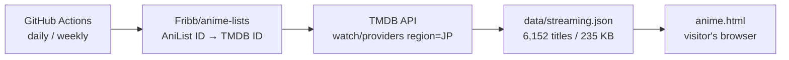

# Anime Matome

*日本語版は [README.ja.md](README.ja.md) をご覧ください。*

A single-file web app that collects seasonal anime from public APIs and shows them as a
browsable list, a weekly broadcast schedule, and — the part you won't find in most anime
trackers — **where each title is actually streaming in Japan**.

- **Landing page**: https://naatlant.github.io/anime-matome/
- **App**: https://naatlant.github.io/anime-matome/anime.html

No build step, no framework, no API key required for visitors. The app itself is one HTML
file you can open in a browser.

> **Note**: the user interface is in Japanese. The streaming availability is Japan-only,
> which is the point — services like dAnime, U-NEXT and FOD rarely show up in
> international anime databases.

## Features

| Feature | Description |
| --- | --- |
| Seasonal listing | Detects the current broadcast season from the visitor's date. One-click presets for previous / next season, currently airing, all-time top, and best of the year |
| Filtering | Year (1960–) × season × 6 sort orders × format × genre × minimum score × keyword search |
| Automatic stats | Title count, average score, number currently airing, plus distribution by genre / studio / source material |
| Weekly schedule | This week's broadcasts by day of week. Days start at 5 a.m. and late-night slots use the Japanese 24-hour convention (25:30 = 1:30 the next morning) |
| **Streaming in Japan** | dAnime, Prime Video, U-NEXT, Netflix, Hulu and others, for 6,152 titles |
| **Japanese synopses** | The upstream synopsis is English only, so the app pulls the lead section of the Japanese Wikipedia article and falls back to English when no article matches |
| **Hover preview** | Hovering a card opens an enlarged panel with the banner art, score, streaming services and next episode |
| Details | Air period, next episode, studio, source material, trailer, official and streaming links |
| Favorites | Stored in localStorage. The weekly schedule can be filtered down to favorites only |
| **Shareable URLs** | Filters and the active tab live in the query string, so any view can be bookmarked, shared, and navigated with the browser's back button |
| Infinite scroll | Loads the next page as you scroll, pausing after 10 consecutive pages |
| Offline tolerance | Falls back to the most recent cached response and tells you how old it is |

Responsive down to phone width, and follows the OS light/dark preference.

## Tech stack

| Area | Details |
| --- | --- |
| Front end | One HTML file (`anime.html`, ~1,200 lines). HTML + CSS + vanilla JavaScript, zero dependencies |
| Anime data | [AniList](https://anilist.co) GraphQL API (two queries sharing one field fragment) |
| Synopses | Japanese Wikipedia API (exact title → title without season markers → search) |
| Streaming | TMDB API, data sourced from JustWatch. Fetched by GitHub Actions, served as a static JSON file |
| Caching | localStorage, 6 hours (AniList allows 30 requests/minute) |
| Layout | CSS Grid, `prefers-color-scheme` |

## How the streaming data works

The app never calls the streaming API at runtime. GitHub Actions fetches the data ahead of
time and commits a static JSON file. **The API key lives in GitHub Secrets and never reaches
the published page.**



Split-cour releases and sequels point at the same TMDB series, so requests are deduplicated
by TMDB ID before fetching (8,123 entries → 5,452 requests).

| Run | Schedule | Scope |
| --- | --- | --- |
| Daily | 03:00 JST | Previous/current/next season plus all-time top, merged into the existing data (~250 requests) |
| Weekly | Sunday 03:30 JST | Full refresh of every mapped title (~5,450 requests, about 6 minutes) |

### Coverage

Only titles that exist in the ID mapping can carry streaming data, so older shows drop off.

| Sample | Titles with streaming data |
| --- | --- |
| All-time top 50 | 88% |
| Spring 2006 | 82% |
| Spring 2020 | 76% |
| Spring 1998 | 42% |

## Repository layout

```
anime.html                        the app (single file)
index.html                        landing page
data/streaming.json               Japanese streaming availability (generated by Actions)
scripts/fetch-streaming.mjs       fetch script
.github/workflows/streaming.yml   daily / weekly update workflow
assets/                           TMDB logo, social card
```

## Running locally

```
git clone https://github.com/Naatlant/anime-matome.git
```

Open `anime.html` in a browser. Everything works **except the streaming badges**, because
browsers block `fetch` for local files. Serve the directory over HTTP if you want those too.

## Forking

You only need this if you want the streaming data to keep updating. Displaying the existing
data requires nothing.

1. Get a free API key from [TMDB](https://www.themoviedb.org/settings/api) (choose *Developer*)
2. Add it as a repository secret named `TMDB_API_KEY`
3. Set Settings → Actions → General → Workflow permissions to **Read and write permissions**

To run the script by hand, put the key in a `.tmdb_key` file at the repository root
(already git-ignored).

```
node scripts/fetch-streaming.mjs        # current seasons, merged
node scripts/fetch-streaming.mjs --all  # every title, full replace
```

## License

The source code is [MIT](LICENSE) — but **the license covers only the code written in this
repository**.

| Path | License |
| --- | --- |
| `anime.html`, `index.html`, `scripts/`, `.github/` | MIT |
| `data/streaming.json` | **Not MIT.** Belongs to TMDB / JustWatch |
| `assets/tmdb.svg` | **Not MIT.** TMDB trademark, bundled for the attribution their terms require |

The streaming data is governed by the
[TMDB API Terms of Use](https://www.themoviedb.org/api-terms-of-use), which do not permit
sublicensing TMDB content. If you want to reuse that data, **get your own TMDB API key and
comply with those terms yourself**. Commercial use is not permitted, and TMDB counts ad
revenue and traffic generation as commercial.

## Privacy

Nothing is collected. There is no analytics, no advertising, and no backend of our own.
Favorites and preferences are stored in your browser's localStorage and never leave your
device.

## Notes on upstream terms

- **Unofficial.** This project is not affiliated with, endorsed by, or approved by AniList
  or TMDB.
- **AniList** allows non-commercial use of its API and asks that clients not act as
  competing list/tracker services. This app links back to each title's AniList page and
  adds Japan-specific information (streaming availability, broadcast-day handling) that
  AniList does not provide.
- **[Fribb/anime-lists](https://github.com/Fribb/anime-lists)**, used for ID mapping,
  currently publishes **no license**. The mapping is consumed at build time only, and the
  generated file stores nothing more than ID pairs, but be aware of this if you fork the
  project.
- Cover images are served from AniList's CDN and remain the property of their rights
  holders.

## Credits

- Titles, artwork, schedules: [AniList](https://anilist.co)
- Synopses: [Japanese Wikipedia](https://ja.wikipedia.org/), CC BY-SA
- Streaming availability: [](https://www.themoviedb.org/) / JustWatch
- ID mapping: [Fribb/anime-lists](https://github.com/Fribb/anime-lists)

> This application uses TMDB and the TMDB APIs but is not endorsed, certified, or otherwise
> approved by TMDB.

All rights to the individual works belong to their respective holders. This is a
non-commercial project and makes no guarantee about the accuracy of what it displays.
Streaming availability changes often — confirm on the service itself before relying on it.
